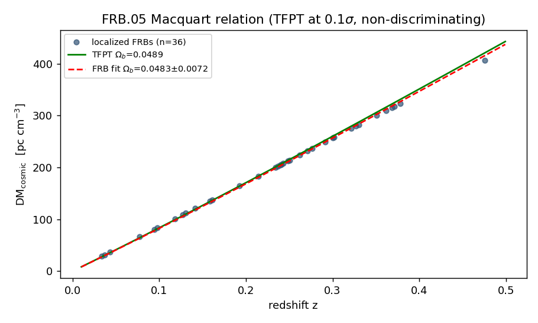
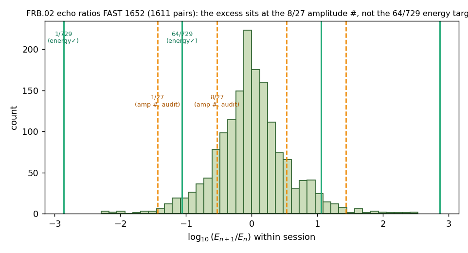
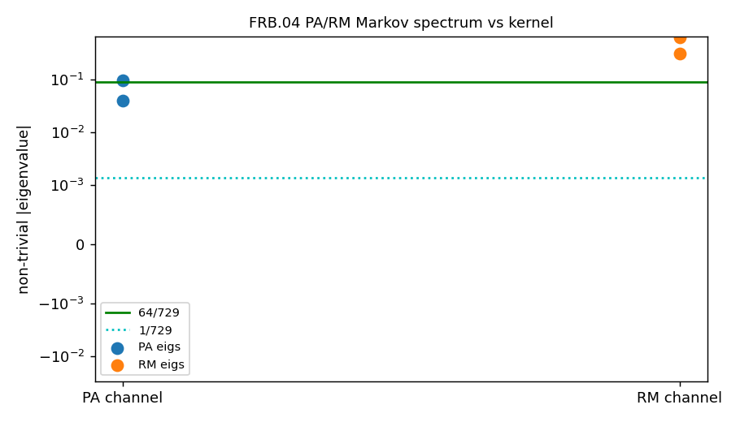
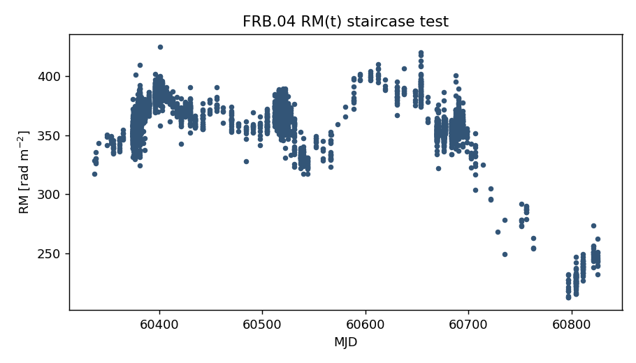
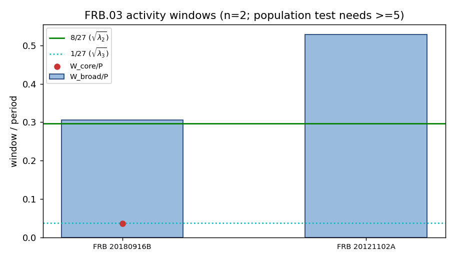
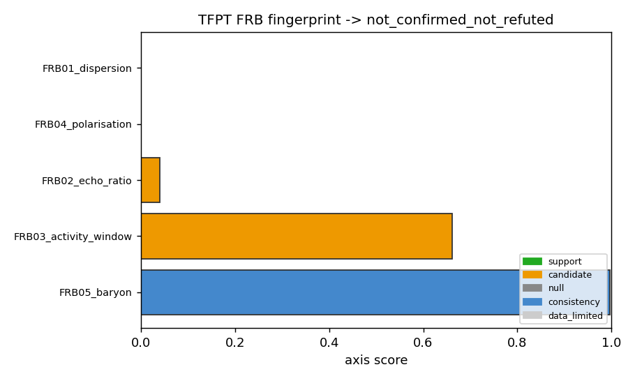

# TFPT signatures in real Fast Radio Burst data

A **preregistered, multi-dataset, surrogate-calibrated** search for residual
TFPT *boundary-recovery* signatures in real, public FRB data. The pipeline is
built to either find a replicated, multi-source eigenvalue fingerprint **or kill
the FRB trace cleanly** — not to "find more numbers".

- **Standalone:** an exploration experiment under `experiments/`. **Not** wired
  into the verification suite, ledger, or website; it makes **no** load-bearing
  TFPT claim.
- **Firewall:** every result is a **search target, not a claim** (§1).
- **Frozen kernel:** the recovery ratios are exact rationals derived from the two
  axioms; no fitted exponents (guarded by `tests/`, §4).
- **Current verdict (deterministic at `--seed 0`):** `not_confirmed_not_refuted`.
  Two **candidates** (FRB.03 activity window, FRB.02 echo ratio), one
  **consistency** axis (FRB.05 Ω_b), one **null** (FRB.04 polarisation, tested on
  6134 real bursts), one **data-limited** axis (FRB.01). No replicated,
  discriminating support.

---

## 1. Firewall — what TFPT may and may not say about FRBs

FRBs are **not** new gravity and **not** a direct Hawking signature:

```
FRB = compact magnetised source + plasma transfer (DM, RM, scattering, lensing)
      + (possible) boundary-recovery kernel residual
```

The only admissible statement:

> **IF** the TFPT boundary recovery is real, **THEN** FRB repeaters may show a
> few *dimensionless* echoes of the recovery kernel *after* standard plasma is
> removed.

**Language rules (enforced; `hypotheses/frb_tfpt_v1.yaml`):**

- Forbidden: "FRBs confirm TFPT" · "FRBs show the boundary kernel" ·
  "FRB 20180916B proves the recovery formula" · "DM(z) confirms TFPT Ω_b".
- Allowed: "FRBs provide a preregistered search space …" · "FRB 20180916B is a
  single window candidate, not replicated" · "FRB.02 shows a single-source 8/27
  candidate that fails the q<0.01 / replication bar" · "FRB.05 is consistent but
  not discriminating vs Planck".

---

## 2. How I proceeded (procedure, in order)

1. **Read and separated the hypotheses.** Started from `problem_b.txt` (the
   qualitative "phi-attractor cascade" picture) and then the refined note that
   recast FRBs as a probe of the **boundary-recovery kernel** with a specific
   eigenvalue spectrum. Adopted the firewall (§1) as the governing constraint.
2. **Froze the kernel from the axioms** (`recovery_kernel.py`): the recovery
   ratios are exact `Fraction`s built from `2/3 = |Z₂|/N_fam` and the transport
   exponent `6` — no FRB number and no fitted exponent enters the prediction
   layer (§3).
3. **Preregistered** the search (`hypotheses/frb_tfpt_v1.yaml`): fixed kernel
   ratios, tolerances, null models, per-target success criteria, and the language
   rules. Added guard tests (`tests/test_recovery_kernel_constants.py`, §4) so the
   kernel cannot be edited after seeing data.
4. **Ran a data-acquisition campaign** (§5, and `data/README.md` →
   *Data-acquisition audit*). For each target I went to the primary source
   (VizieR, IOPscience machine-readable supplements, ScienceDB, arXiv ancillary,
   Zenodo, GitHub), recorded what was downloadable anonymously, and what was
   login/supplement-walled. Bundled everything that was cleanly public.
5. **Implemented one test per signature** (§6–§7), each with: a fixed kernel
   ratio (never refit), an explicit **null model** (surrogates or a systematic
   floor), a significance statistic, a `[0,1]` score, and a written success
   criterion.
6. **Hardened the aggregator** (`fingerprint.py`): an `EvidenceAxis` carries
   `status`, `q_value`, `discriminating`, `replicated`. `aggregate_axes` promotes
   an axis to **support** only if it is replicated, discriminating, and `q<0.01`;
   otherwise it stays candidate / null / consistency / data-limited. The overall
   verdict can only become `confirmed` on real support.
7. **Ran deterministically** (`frb-tfpt analyze --seed 0`), wrote
   `results/results.json` + plots, and recorded the verdict (§8). Re-ran after
   each dataset arrival (the FAST 1652 energy table, then the FRB 20240114A
   polarimetry) and updated the axis statuses accordingly.

The two pivotal data events: (a) obtaining the **FAST 1652-burst FRB 20121102A
energy table** turned FRB.02 from a thin 144-burst null into a real test that
surfaced a marginal 8/27 candidate; (b) obtaining the **FAST 6134-burst
FRB 20240114A polarimetry** turned FRB.04 from `data_limited` into a real
**null**.

---

## 3. Theory coupling — the frozen recovery kernel

Everything below is **derived** from the two TFPT axioms (identical to
`verification/tfpt_constants.py`); no SI value and no FRB number is hard-coded
into `recovery_kernel.py` / `tfpt_ladder.py`.

```
P1   c3    = 1/(8*pi)                 = 0.03978874     (seam/boundary constant)
P2   g_car = 5                                          (carrier rank)
     phi0  = 1/(6*pi) + 3/(256*pi^4)  = 0.05317392     (retained seed)
     N_fam = 3,  |Z2| = 2
```

Two structural ingredients build the **Page / boundary-recovery spectrum**:

- the attractor ratio `2/3 = |Z₂|/N_fam` (the Koide IR attractor; `1/3 = 1/N_fam`);
- the transport exponent `6` = the Z₆/A₃ transport cycle that also sets the gap
  `Δ = 6 ln(3/2) = 2.4327902`.

```
energy channel     spec(T) = { 1, (2/3)^6, (1/3)^6 } = { 1, 64/729,  1/729 }
                                                      = { 1, 0.0877915, 0.00137174 }
amplitude channel  roots   = { 1, (2/3)^3, (1/3)^3 } = { 1, 8/27,    1/27   }
                                                      = { 1, 0.296296, 0.0370370 }
sub-burst channel          = { 1,  2/3,     1/3   }   = { 1, 0.666667, 0.333333 }
```

Why three channels, no new numbers: an **energy/information** observable reads
the eigenvalue `λ`; a **field-amplitude / visibility** observable reads `√λ`
(hence the cube roots `8/27`, `1/27`); a raw **sub-burst** step reads the
unpowered ratio. They are the same kernel under three readouts.

**Seed block (cosmology coupling), same retained seed `phi0`:**

```
beta_rad = phi0/(4*pi)            = 0.00423097 rad = 0.242435 deg
Omega_b  = (4*pi - 1) * beta_rad  = 0.0489410
```

`frb-tfpt audit` prints all of the above as exact fractions + float views.

---

## 4. Preregistration & kernel freeze (anti-exponent-shopping)

- `hypotheses/frb_tfpt_v1.yaml` — the **frozen hypothesis**. Contains the kernel
  ratios (as exact strings `64/729`, `1/729`, `8/27`, `1/27`, `2/3`, `1/3`), the
  tolerances (`tolerance_dex_echo: 0.10`, `tolerance_window_relative: 0.10`), the
  global rules (`no_refitted_exponents`, `require_surrogate_calibration`,
  `require_multi_source_replication`, `single_source_match_is_candidate_only`,
  `q_threshold: 0.01`), the per-target observables / null models / success
  criteria, and the allowed/forbidden language.
- `tests/test_recovery_kernel_constants.py` — 7 guard tests (run with
  `python tests/test_recovery_kernel_constants.py`; pytest optional). They assert:
  (i) the energy/field/step ratios are exact `Fraction`s; (ii) the float views
  equal the fractions; (iii) the prediction layer imports no data module and
  contains **no FRB magic numbers** (denylist: `16.35`, `528.9`, `1652`, `6131`,
  `1539`, source ids, `rad m`, `Jy`); (iv) no symbol named `*fit_exponent*`;
  (v) the YAML ratios equal `kernel_fractions()` exactly. **Status: 7/7 pass.**

---

## 5. Data — exact details (real, public)

`python scripts/fetch_data.py` re-downloads the VizieR + IOPscience tables.
Full provenance + acquisition audit in `data/README.md`.

| File | Source / how obtained | N | Columns used (units) |
|---|---|---|---|
| `frb20121102_fast_li2021_1652.tsv` | Li et al. 2021, Nature 598, 267 — VizieR `J/other/Nat/598.267/tables1` (asu-tsv) | 1652 | `Burst`, `MJD`, `DM`, `Width`, `Bandwidth`, `Fp`, `Fluence`, **`E` (erg)** |
| `FAST_FRB20240114A_pol_catalog_v5.csv` | Wang et al. 2026, arXiv:2603.20663 — ScienceDB `10.57760/sciencedb.Fastro.00040` (free login; user-supplied) | 6134 | `MJD_topo` (d), `RM` (rad m⁻²), `DM`, `Weff` (ms), `Bandwidth` (MHz), `S/N`, `DOL`=L/I (%), `DOC`=V/I (%), `PA_mean` (deg) |
| `frb_dmz_adb84d_table4.txt` | ApJ `10.3847/1538-4357/adb84d` Table A1 (IOP suppdata) | 36 | `z_spec`, `DM_obs`, `DM_MW(disk+halo)`, `DM_host^s` (pc cm⁻³) |
| `frb_dmz_adeb72_table1.txt` | Sharma et al. 2024, ApJ `10.3847/1538-4357/adeb72` Table 1 | 117 | `Redshift`, `DM`, `DM_exc` (pc cm⁻³) |
| `frb_pol_pandhi2024_table1.txt` | Pandhi et al. 2024, ApJ 968, 50 Table 1 (IOP suppdata) | 118 | `RM_obs,FDF`, `RM_MW`, `L/I` |
| `frb20121102_aggarwal2021.tsv` | Aggarwal et al. 2021, ApJ 922, 115 — VizieR `J/ApJ/922/115/table5` | 144 | `S` (Jy ms), `MJD`, `muf`, `DM` |
| `chime_catalog1.tsv` | CHIME/FRB 2021, ApJS 257, 59 — VizieR `J/ApJS/257/59/table2` | 600 | `Fluence`, `MJD400`, `Fpk`, `DMfitb`, `RpName`, `Nsb` |
| *curated in `activity_windows.py`* | CHIME/FRB 2020 (arXiv:2001.10275); Rajwade+2020 (MNRAS 495, 3551) | 2 | `P`, `W_broad`, `W_core` (+ errors), days |

**FRB 20240114A specifics** (the FRB.04 enabler): 6134 bursts spanning
MJD 60337.2–60824.9 = **487.7 d over 95 nights**; `RM` ranges **212.5 → 425.3**
rad m⁻² (the ~200 rad m⁻² secular evolution, span 212.8); `DM` stable
524.4–536.3; `PA_mean` ∈ [−85.1°, +85.7°]. The loader
`load_fast_20240114A_pol` prefers `..._v5.csv` (clean header + full-precision
MJD) over the base CSV and `..._v4.csv` (extra index column).

**Acquisition audit (summary).** The FRB 20240114A catalog is on ScienceDB and
login-walled for anonymous download; I verified that arXiv source (LaTeX +
figures only), DataCite (no `contentUrl`), Croissant/JSON-LD (client-side JS),
the ScienceDB file-tree API (returns `User Not Login` even from the page origin
with cookies), and direct download-id enumeration are all blocked — only a free
account works. Non-login alternatives found but **insufficient** (not bundled):
`SukiYume/RMS` (FRB 20201124A RM, ~32 bursts, single-epoch, no MJD),
FRB 20190520B (Anna-Thomas; code-only on Zenodo, RM table paywalled),
FRB 20240619D (journal/CDS supplement, absent from the arXiv source). Full record
in `data/README.md`.

**Still pending drop-in:** `frb20240619D_wideband.tsv` (1539 bursts;
arXiv:2505.08372) → activates the RM-memory / session-decay / frequency-window
stress tests. Loaders read column aliases from `data_io._COL_ALIASES`; an absent
file makes the dependent axis report `data_limited` rather than guessing.

---

## 6. The TFPT signatures searched

Each signature maps a **fixed** kernel ratio onto an FRB observable. "Channel"
indicates whether the observable reads `λ` (energy), `√λ` (field/visibility), or
the unpowered step.

| ID | Signature | Predicted value(s) | Channel | Observable |
|---|---|---|---|---|
| **FRB.01** | no native (non-plasma) dispersion | `A_TFPT = 0` | — | residual `t(ν)` after DM, scattering removal |
| **FRB.02** | recovery / echo ratios | `E_{n+1}/E_n ≈ 64/729`; amp `8/27`; step `2/3` (+ inverses) | energy / field / step | consecutive within-session energy ratios |
| **FRB.03** | activity-window eigenwidths | `W_broad/P ≈ 8/27`, `W_core/P ≈ 1/27` | field / visibility | periodic-repeater phase-window widths |
| **FRB.04** | PA/RM Markov spectrum (strong μ4/D4) | `spec(T) = {1, 64/729, 1/729}` | energy | per-burst PA-class / RM-residual state transitions |
| **FRB.05** | baryon fraction | `Ω_b = 0.0489` | seed block | Macquart `DM(z)` slope of localized FRBs |
| *generic* | energy cascade | adjacent log-E spacings = a single kernel ratio | energy | GMM cluster centres of one source's energies |
| *shared* | multi-channel recovery memory | same eigenvalue in ≥2 observables | mixed | AR(1) memory of `log E`, `RM_resid`, `log Δt` |

---

## 7. Analysis methods — exact algorithms

All surrogate p-values use the `(1 + #{null ≥ obs}) / (n_surrogate + 1)` estimator.

### FRB.05 — DM(z) baryon test (`dmz_baryon.py`, `cosmology.py`)
- **Model:** Macquart relation
  `⟨DM_cosmic(z)⟩ = (3 c H₀ Ω_b f_IGM χ)/(8π G m_p) · I(z)`,
  `I(z)=∫₀ᶻ (1+z′)/E(z′) dz′`, `E(z)=√(Ω_m(1+z)³+Ω_Λ)`.
  Constants: `Ω_m=0.315`, `Ω_Λ=0.685`, `h=0.674`, `χ=7/8=0.875`, `f_IGM=0.84`.
- **Per FRB:** `DM_cosmic = DM_obs − DM_MW − DM_host_obs` (adb84d uses the
  published budget; Sharma uses `DM_exc` minus a 60/(1+z) pc cm⁻³ host prior).
- **Fit:** one-parameter weighted LSQ of `Ω_b` through the origin vs `I(z)`,
  per-point `σ = √((0.2·DM_cosmic)² + 80²)`; bootstrap `n_boot=2000`.
- **Error:** systematics-dominated — a **15 % floor** is added in quadrature
  (`σ = √(σ_boot² + (0.15·Ω_b)²)`) for f_IGM + host-model uncertainty.
- **Success:** consistency only — `Ω_b(TFPT)=0.0489` vs `Ω_b(Planck)=0.0493`
  differ <1 %, far below FRB scatter, so this can never discriminate TFPT.

### FRB.03 — activity-window population (`periodic_population.py`)
- **Statistic:** per source `W_broad/P` (rel-err to `8/27`), `W_core/P` (to
  `1/27`), with Gaussian error propagation from `P, W_broad, W_core` errors.
- **Nulls:** random duty-cycle windows `~U(0,1)`, `n_null=5000`; the population
  statistic is the median broad rel-err. **Leave-one-out**: does removing any one
  source flip "median rel-err < 0.10"?
- **Success:** `≥5` periodic repeaters, median broad rel-err `<0.10`, `≥3` sources
  with a core window near `1/27`, LOO-stable, and `null q<0.01`. Only 2 robust
  periodic repeaters exist ⇒ best attainable status is **candidate**.

### FRB.02 — session-aware echo ratios (`echo_ratio.evaluate_echo_ratios_by_session`)
- **Statistic:** within each observing night, consecutive `log10(E_{n+1}/E_n)`
  (energy when present, else fluence). For each of the 6 kernel ratios **and their
  inverses** (12 targets), count log-ratios within `±0.10 dex`.
- **Null:** shuffle the energies **within each session** (preserves the session
  energy distribution and session structure), `n_surrogate=2000`; enrichment =
  obs/mean-null; **Benjamini-Hochberg q-values** across the 12 targets.
- **Success:** `q<0.01` and enrichment `>1.2` in **≥2 sources** (single-source =
  candidate).

### FRB.04 — PA/RM Markov spectrum (`markov_spectrum.py`)
- **States (`n_states=4`):** PA → four D4 sectors `[0,45),[45,90),[90,135),[135,180)`
  after **per-session circular-mean detrending**; RM → cubic-detrended residual
  quantised into 4 equal-occupancy bins.
- **Matrix:** row-stochastic transition matrix; take the two non-trivial
  `|eigenvalues|` (drop the ≈1 stationary one).
- **Comparison:** Euclidean distance of `(λ₂,λ₃)` to the kernel `(64/729, 1/729)`;
  **bootstrap CI** on the eigenvalues (block bootstrap of the state sequence,
  `n_boot=1000`); **null** = random row-stochastic matrices `Dirichlet(2)`,
  `n_null=2000` → `null_p = P(d_null ≤ d_obs)`.
- **Success:** the bootstrap CI must **contain** the kernel pair **and** `null
  p<0.01`. Score `= [CI∋kernel ∧ p<0.01]·exp(−(dist/0.05)²)`.

### FRB.01 — no native dispersion (`no_native_dispersion.py`)
- **Model:** `t(ν)=t₀ + K·DM·ν⁻² + A_scat·ν⁻⁴ + A_TFPT·ν^index`; weighted LSQ;
  **kill test** = `A_TFPT` must be `≤2σ` from 0. Needs per-burst sub-band timing
  (raw/baseband), absent from catalogues ⇒ `raw_data_required`.

### Generic cascade (`energy_clusters.py`)
- **Null fit:** log-normal in energy + KS test. **Multimodality:** Gaussian-
  mixture BIC scan `k=1..6`. **Spacing ladder** (`fit_spacing_ladder`): if `≥3`
  clusters, compare the adjacent log-E spacings to preregistered ratios
  (`(3/2)⁶=729/64`, `(3/2)³=27/8`; audit-only: `3/2`, `2`, `5/3`) within `0.10`;
  smooth-null surrogates `n_surrogate=150`. **Log-periodicity:** Rayleigh power on
  the log-energy axis over spacing ratios `1.3–6.0` (`n_freq=400`), surrogate-
  calibrated (`n_surrogate=400`).

### Shared eigenvalue (`recovery_observable_model.py`)
- **Per observable** (`log_energy`, `rm_residual`, `log_waiting`): AR(1) memory
  coefficient `a` (lag-1 regression), bootstrap CI (`n_boot=1000`), nearest kernel
  memory value in `{2/3, 1/3, 8/27, 64/729}`. **Score rises only if ≥2 channels'
  CIs contain the same kernel value** — coincidences are not stacked.

### Verdict gating (`fingerprint.py`)
- `EvidenceAxis(status, score, p_value, q_value, discriminating, replicated)`;
  `aggregate_axes` → an axis is **support** only if `status==support ∧
  discriminating ∧ replicated ∧ q<0.01`; else it is bucketed candidate / null /
  consistency / data-limited. Overall `confirmed` requires ≥1 support axis.

---

## 8. Results — exact numbers (`--seed 0`)

**OVERALL: `not_confirmed_not_refuted`** — support: none · candidates:
`FRB03_activity_window`, `FRB02_echo_ratio` · consistency: `FRB05_baryon` ·
null: `FRB04_polarisation` · data-limited: `FRB01_dispersion`.

### FRB.05 — baryon `Ω_b` → consistency (non-discriminating), score 1.00
- adb84d (n=36): `Ω_b = 0.0483 ± 0.0072` (stat 0.0001, syst-floored). TFPT
  `0.0489` at **0.1σ**; Planck `0.0493` at 0.1σ.
- Sharma (n=117, constant host prior): `Ω_b = 0.0663 ± 0.0103`; TFPT at 1.7σ.
  The inter-sample spread (0.048 vs 0.066) **is** the host-model systematic.
- Verdict: TFPT consistent with the clean-budget sample; cannot single out TFPT
  from Planck.

### FRB.03 — activity windows → candidate, score 0.66
- FRB 20180916B: `W_broad/P = 0.3058` vs `8/27=0.2963` (**3.2 %**);
  `W_core/P = 0.0367` vs `1/27=0.0370` (**0.9 %**). Double match.
- FRB 20121102A: `W_broad/P = 0.5287` vs `8/27` (**78 %** off). No match.
- Population: 1/2 broad matches, `n=2 < 5` required, random-window null
  `p=0.112`, leave-one-out **not** stable ⇒ candidate, not support.

### FRB.02 — echo ratios on FAST 1652 → candidate, score 0.04
- 1652 bursts, **1611 within-session pairs**, 41 sessions.
- `8/27` (`sqrt_lambda2_amp`): enrichment **1.246**, p=0.004, **BH q=0.048**.
- All other targets: `1/3` q=0.16, `2/3` q=1.0, `64/729` q=1.0 (enrich<1),
  `1/27` q=1.0.
- The 8/27 excess survives BH at 0.05 but **fails the preregistered q<0.01** and
  is single-source ⇒ candidate. This is the single most interesting result.

### FRB.04 — PA/RM Markov spectrum on FRB 20240114A (6134 bursts) → null, score 0.00
- **RM channel:** eigenvalues `(0.618, 0.310)`, kernel `(0.0878, 0.0014)`;
  distance 0.613; `null p=0.996` (further from the kernel than random). RM(t) is a
  smooth wandering drift (330→400→230 rad m⁻²), the opposite of a discrete
  staircase. **Clean null.**
- **PA channel:** eigenvalues `(0.0943, 0.0398)`. The **leading** non-trivial
  eigenvalue `0.0943` is **7.4 %** from `64/729=0.0878` — intriguing — but the
  second, `0.0398`, is ~29× the predicted `1/729=0.00137`, so the bootstrap CI
  does **not** contain the kernel pair and the preregistered success fails. (The
  PA `null p=0.000` reflects near-memorylessness of the PA-state sequence, not a
  kernel match.) **Strong μ4/D4 prediction not supported.**

### Generic / shared (FAST 1652 energies)
- Energy distribution: log-normal **rejected** (KS p=2e-23); GMM best `k=3`
  (ΔBIC=315). Cluster centres `log10 E = [37.63, 37.75, 38.52]` → adjacent
  spacings `[0.12, 0.77] dex` — **non-uniform**; closest single ratio `27/8` at
  **77 %** off (ladder p=0.007). Log-periodogram peaks at the search boundary
  (ratio 6.0). ⇒ real structure, but **no equal-spaced kernel cascade**.
- Shared eigenvalue: only `log_energy` has appreciable memory (AR(1) `a=0.343`,
  curiously near `1/3=0.333`); `log_waiting` `a=−0.04`. **No** kernel value shared
  across ≥2 channels.
- CHIME sanity: drift downward fraction 0.76 (the ordinary "sad trombone");
  FRB 20180916B folds at 16.33 d with Rayleigh `z=28.7` (timing pipeline OK).

| Macquart Ω_b (FRB.05) | FAST 1652 echo ratios (FRB.02) | PA/RM Markov spectrum (FRB.04) |
|---|---|---|
|  |  |  |
| **RM(t) staircase (FRB.04)** | **activity windows (FRB.03)** | **fingerprint summary** |
|  |  |  |

---

## 9. Red-team rules (enforced in code)

A pattern counts as **support** only if it satisfies **all**: (1) the fixed kernel
ratio, no refitted exponent; (2) surrogate calibration or a realistic systematic
floor; (3) `q < 0.01`; (4) replication in ≥2 independent sources or channels. The
gating in `fingerprint.py` refuses to promote single-source results — both
`FRB02_echo_ratio` and `FRB03_activity_window` stay **candidate** despite nonzero
scores, and `FRB04_polarisation` is **null** despite the PA leading-eigenvalue
near-coincidence.

---

## 10. Reproduce

```bash
cd experiments/frb-tfpt-signatures
. ../tfpt-discovery/.venv/bin/activate            # numpy/scipy/sklearn/matplotlib/pyyaml
python tests/test_recovery_kernel_constants.py    # kernel-freeze guard (7 tests, all pass)
PYTHONPATH=src python -m frb_tfpt.cli audit        # print the frozen kernel + ratios
PYTHONPATH=src python -m frb_tfpt.cli analyze --seed 0   # full search -> results/
python scripts/fetch_data.py                       # refresh the VizieR + IOPscience tables
```

`analyze` is deterministic at fixed `--seed` (~50 s on the bundled data; all
RNGs and `GaussianMixture(random_state=seed)` are seeded).

---

## 11. Outputs

- `results/results.json` — every number: per-axis results under
  `search_targets` / `generic`, the typed `axes` list, and the `overall` verdict
  buckets.
- Plots: `frb05_macquart.png`, `frb03_population_windows.png`,
  `frb02_fast_echo_ratio.png`, `frb04_markov_spectrum.png`,
  `frb04_rm_staircase.png`, `frb_fingerprint_summary.png`, `frb121102_energy.png`,
  `frb121102_logperiodogram.png`, `frb121102_waiting.png`.

---

## 12. Module layout

```
hypotheses/frb_tfpt_v1.yaml     # frozen preregistration (kernel, nulls, success, language)
tests/test_recovery_kernel_constants.py   # kernel-freeze + no-data-leak guards (7 tests)
src/frb_tfpt/
  recovery_kernel.py     # FROZEN kernel (exact Fractions) + seed block (derived)
  tfpt_ladder.py         # generic cascade ratios (derived)
  cosmology.py           # Macquart relation E(z), I(z), DM_cosmic, Omega_b fit
  dmz_baryon.py          # FRB.05 Omega_b consistency
  activity_windows.py    # FRB.03 per-source windows (curated, cited, with errors)
  periodic_population.py # FRB.03 population test (LOO + nulls)
  echo_ratio.py          # FRB.02 session-aware ratios + BH q-values
  markov_spectrum.py     # FRB.04 PA/RM transition-matrix spectrum
  recovery_observable_model.py  # shared multi-channel AR(1) eigenvalue search
  no_native_dispersion.py       # FRB.01 kill test
  energy_clusters.py     # GMM + log-periodicity + fit_spacing_ladder
  drift_freq.py, timing.py, polarization.py, rm_steps.py
  fingerprint.py         # EvidenceAxis + aggregate_axes (gated verdict)
  data_io.py             # all loaders + drop-in repeater column contracts
  cli.py                 # `frb-tfpt audit` / `frb-tfpt analyze`
scripts/fetch_data.py    # re-download the VizieR/IOP datasets
data/  results/          # real catalogues + provenance; generated outputs
```

---

## 13. What would change the verdict

1. **FRB.02 → support:** replicate the 8/27 within-session energy-ratio excess in
   a second large single-source sample at `q<0.01` (e.g. a second FAST storm of
   FRB 20121102A, or FRB 20240619D).
2. **FRB.04 → candidate:** test whether the PA leading-eigenvalue proximity to
   `64/729` (7.4 %) replicates in a second repeater's per-burst PA/RM sequence;
   the RM channel is already a clean null here.
3. **FRB.03 → testable:** ≥5 confirmed periodic repeaters with measured
   `P, W_broad, W_core`.
4. **Shared eigenvalue:** the same kernel value (e.g. the `log_energy` AR(1)
   ≈1/3 hint) appearing across ≥2 observables of one source.

A clean multi-source null is itself a result: it would show FRBs are not a good
carrier of the boundary-recovery kernel. *Nature owes us no drama.*

---

## 14. References

CHIME/FRB Collab. 2021 (ApJS 257, 59); CHIME/FRB Collab. 2020 (Nature 582, 351,
FRB 20180916B period); Li et al. 2021 (Nature 598, 267, FAST 1652 bursts);
Wang et al. 2026 (arXiv:2603.20663; ScienceDB 10.57760/sciencedb.Fastro.00040,
FRB 20240114A polarimetry); Aggarwal et al. 2021 (ApJ 922, 115); Pandhi et al.
2024 (ApJ 968, 50); Sharma et al. 2024 (ApJ 10.3847/1538-4357/adeb72);
localized-FRB DM budget (ApJ 10.3847/1538-4357/adb84d); Rajwade et al. 2020
(MNRAS 495, 3551); Macquart et al. 2020 (Nature 581, 391); FRB 20240619D
(arXiv:2505.08372).

## License

MIT.
