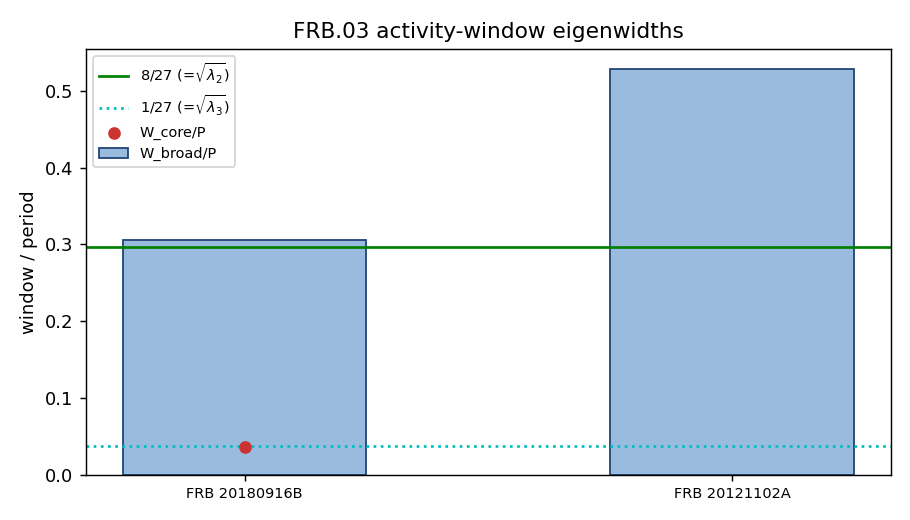
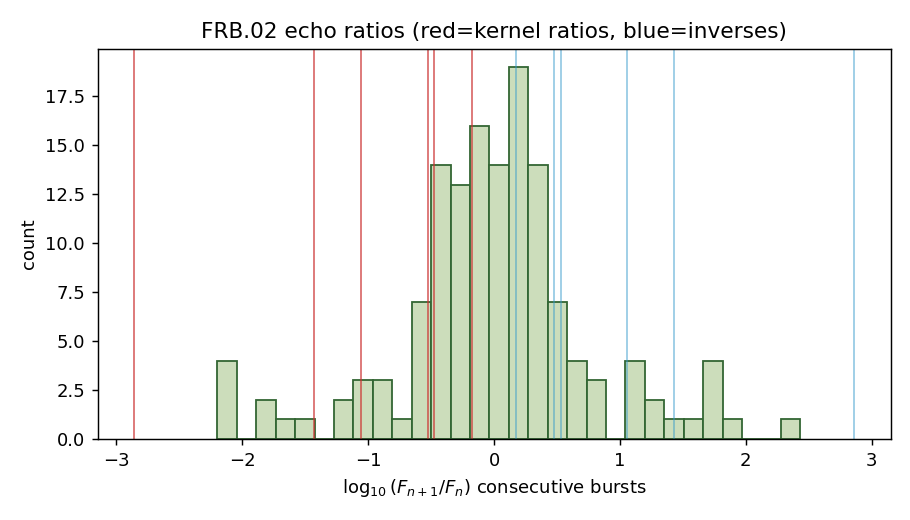
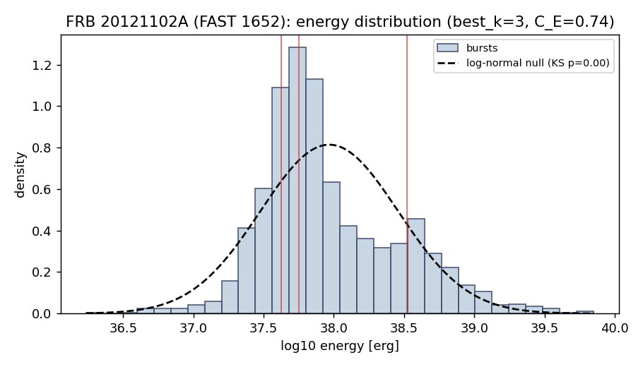
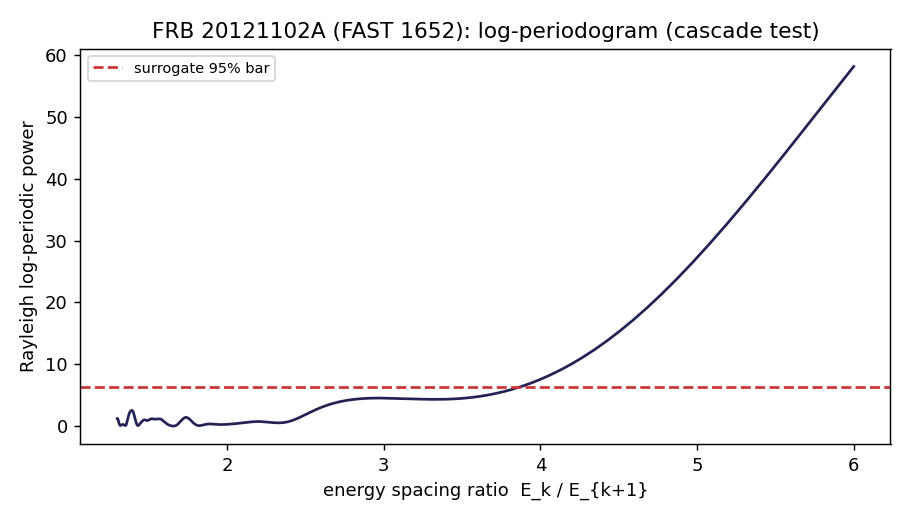
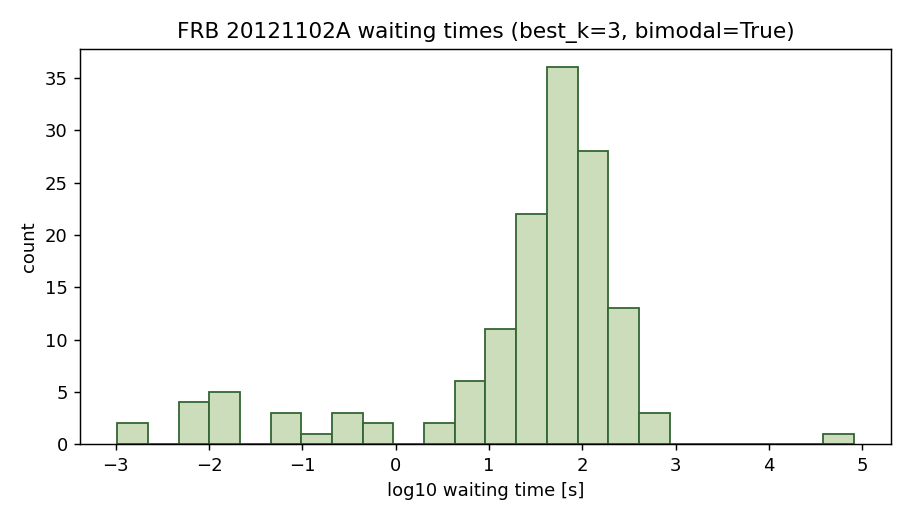
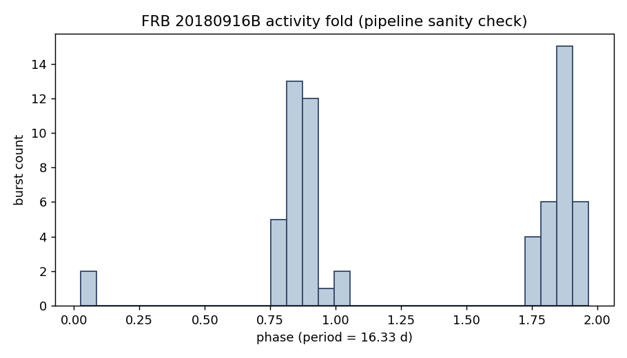

# TFPT signatures in real Fast Radio Burst data

A reproducible pipeline that confronts the TFPT **FRB search targets** with
*real, public* Fast Radio Burst (FRB) data, and reports honest, surrogate- or
systematics-calibrated verdicts.

- **What it is:** a standalone exploration experiment under `experiments/`
  (like `eht-achromatic-residual`). It is **not** wired into the verification
  suite, the ledger, or the website, and makes **no** load-bearing TFPT claim.
- **What it does:** turns the qualitative FRB hypotheses into falsifiable,
  data-driven tests of the TFPT *boundary-recovery kernel*, runs them on five
  real datasets, and prints a scoreboard.
- **Epistemic stance:** every result is a **search target, not a claim**
  (see the firewall below).

---

## 1. Firewall — what TFPT is and is not allowed to say about FRBs

FRBs are **not** new gravity and **not** a direct Hawking signature. An FRB is

```
FRB = compact magnetised source + plasma transfer (DM, RM, scattering, lensing)
      + (possible) boundary-recovery kernel residual
```

The theory may therefore only say:

> **IF** the TFPT boundary recovery is real, **THEN** FRB repeaters may show a
> few *dimensionless* echoes of the recovery kernel *after* standard plasma is
> removed.

Consequences enforced throughout the code:

- TFPT does **not** add a native photon dispersion; the only computed light
  signature is the frequency-independent polarisation rotation
  `beta_rad ≈ 0.2424°`. Any frequency delay is treated as plasma.
- Patterns are tested against the **fixed** kernel ratios `(2/3)^6`, `(1/3)^6`
  and their roots — never against re-fitted exponents.
- A single coincidence (e.g. one periodic repeater) is reported as a candidate,
  never as evidence.

---

## 2. Theory coupling — the TFPT boundary-recovery kernel

Everything below is **derived** from the two TFPT axioms, exactly as in
`verification/tfpt_constants.py`. No SI value and no FRB number is hard-coded
into the prediction layer (`src/frb_tfpt/recovery_kernel.py`,
`src/frb_tfpt/tfpt_ladder.py`).

### 2.1 Axioms and seeds

```
P1   c3    = 1/(8*pi)                 = 0.0397887        (seam / boundary constant)
P2   g_car = 5                                            (carrier rank)
     phi0  = 1/(6*pi) + 3/(256*pi^4)  = 0.0531739        (retained seed)
     N_fam = 3,  |Z2| = 2                                 (families, deck order)
```

### 2.2 The recovery spectrum (Page / boundary recoverability)

The Page-recovery / boundary mutual-information kernel has the spectrum

```
spec(T) = { 1, (2/3)^6, (1/3)^6 } = { 1, 64/729, 1/729 } = { 1, 0.087791, 0.0013717 }
gap     Delta = 6 ln(3/2) = 2.432791
```

with two structural ingredients, both from the axioms:

- the ratio `2/3 = |Z2|/N_fam` (the Koide IR attractor; `1/3 = 1/N_fam`);
- the transport exponent `6` (the Z6 / A3 transport cycle that also sets the
  Koide gap `Delta = 6 ln(3/2)`).

### 2.3 The amplitude (field / visibility) channel = square roots

Many FRB observables read a *field amplitude* or a *visibility window* rather
than an information/energy. Since `energy ~ lambda` but `amplitude ~ sqrt(lambda)`,
the natural quantities are the **roots** of the eigenvalues — no new numbers:

```
energy channel     :  1  ->  (2/3)^6 = 64/729   ,  (1/3)^6 = 1/729
amplitude channel  :  1  ->  (2/3)^3 = 8/27     ,  (1/3)^3 = 1/27
sub-burst channel  :  1  ->  2/3                ,  1/3
                       8/27 = 0.296296 ,  1/27 = 0.037037
```

### 2.4 The seed block (cosmology coupling)

The same retained seed `phi0` fixes the cosmic-birefringence amplitude and the
baryon fraction:

```
beta_rad = phi0/(4*pi)        = 0.0042310 rad = 0.242435 deg
Omega_b  = (4*pi - 1)*beta_rad = 0.048941
```

### 2.5 Prediction table (printed by `frb-tfpt audit`)

| Quantity | Symbol | Value | Channel / use | Provenance |
|---|---|---|---|---|
| subleading eigenvalue | `(2/3)^6` | 0.087791 | energy (echo, drift) | Page recovery |
| sub-subleading | `(1/3)^6` | 0.0013717 | energy | Page recovery |
| amplitude root | `(2/3)^3 = 8/27` | 0.296296 | window / field | sqrt(lambda2) |
| amplitude root | `(1/3)^3 = 1/27` | 0.037037 | window / field | sqrt(lambda3) |
| sub-burst step | `2/3`, `1/3` | 0.6667, 0.3333 | sub-burst | unpowered kernel |
| recovery gap | `6 ln(3/2)` | 2.432791 | rate | Koide transfer |
| birefringence | `beta_rad` | 0.2424° | polarisation intercept | `phi0/(4 pi)` |
| baryon fraction | `Omega_b` | 0.048941 | DM(z) slope | `(4 pi - 1) beta_rad` |

---

## 3. Data sources (all real, public, reproducible)

Re-download the VizieR + IOPscience tables any time with
`python scripts/fetch_data.py`. Provenance details also in `data/README.md`.

| File | Dataset | N | Columns used | Source / DOI | Caveats |
|---|---|---|---|---|---|
| `chime_catalog1.tsv` | CHIME/FRB Catalogue 1 | 600 bursts | `Fluence`, `MJD400`, `Fpk`, `DMfitb`, `RpName`, `Nsb` | CHIME/FRB Collab. 2021, ApJS 257, 59 (VizieR `J/ApJS/257/59`) | fluences are **lower limits**; no redshift for most |
| `frb20121102_aggarwal2021.tsv` | FRB 20121102A bursts | 144 | `S` (fluence), `MJD`, `muf`, `DM` | Aggarwal et al. 2021, ApJ 922, 115 (VizieR `J/ApJ/922/115`) | single source, single epoch ⇒ fluence ∝ energy |
| `frb_dmz_adb84d_table4.txt` | localized FRBs, full DM budget | 36 | `z_spec`, `DM_obs`, `DM_MW(disk+halo)`, `DM_host^s` | ApJ DOI `10.3847/1538-4357/adb84d`, Table A1 | spectroscopic host z; clean DM decomposition |
| `frb_dmz_adeb72_table1.txt` | Sharma et al. 2024 host sample | 117 | `Redshift`, `DM`, `DM_exc` | Sharma et al. 2024, DOI `10.3847/1538-4357/adeb72`, Table 1 | constant host prior subtracted (no per-FRB host model) |
| `frb_pol_pandhi2024_table1.txt` | CHIME non-repeater polarimetry | 118 | `RM_obs,FDF`, `RM_MW`, `L/I` | Pandhi et al. 2024, ApJ 968, 50 (DOI `10.3847/1538-4357/ad40aa`), Table 1 | **non-repeaters** (no PA/RM time series) |
| *(curated, in code)* | periodic-repeater windows | 2 | `P`, `W_broad`, `W_core` | CHIME/FRB 2020 (arXiv:2001.10275); Rajwade et al. 2020 (MNRAS 495, 3551) | only two robust periodic repeaters exist |

---

## 4. Investigation — methodology per search target

Each search target maps a TFPT kernel ratio onto an FRB observable, then tests
the real data against the **fixed** ratio with an explicit null model.

### FRB.05 — DM(z) baryon test (the cleanest statistical channel)
- **Coupling:** `Omega_b = (4 pi - 1) phi0/(4 pi) ≈ 0.0489`.
- **Observable:** the Macquart relation makes localized-FRB cosmic DM a probe of
  `Omega_b`:
  `<DM_cosmic(z)> = (3 c H0 Omega_b f_IGM chi)/(8 pi G m_p) * I(z)`,
  `I(z) = ∫_0^z (1+z')/E(z') dz'` (`cosmology.py`).
- **Method:** per FRB, `DM_cosmic = DM_obs - DM_MW - DM_host_obs`; one-parameter
  weighted least-squares fit of `Omega_b` through the origin vs `I(z)`; bootstrap
  for the statistical error.
- **Honesty:** the error is **systematics-dominated** — `f_IGM` (~5 %) and the
  host-DM model (~10–15 %) dominate, so a 15 % systematic floor is added (it also
  matches the spread between independent samples). `Omega_b(TFPT)=0.0489` and
  `Omega_b(Planck)=0.0493` differ by <1 %, far below FRB scatter, so this test
  **confirms consistency but cannot single out TFPT** over ΛCDM.

### FRB.03 — activity-window eigenwidths (the headline candidate)
- **Coupling:** `W_broad/P ~ sqrt(lambda2) = 8/27`, `W_core/P ~ sqrt(lambda3) = 1/27`.
- **Method:** for each periodic repeater (`activity_windows.py`) compute the
  ratios and the relative error to `8/27` and `1/27`.
- **Honesty:** only two robust periodic repeaters exist, so this is a curated,
  cited *candidate-match* test, explicitly **not** a population claim.

### FRB.02 — recovery / echo fluence ratios
- **Coupling:** clustered afterbursts should pile up at `E_{n+1}/E_n ~ 64/729`
  (energy) or `A_{n+1}/A_n ~ 8/27` (amplitude), or the sub-burst step `2/3`.
- **Method:** time-order one source's bursts, take consecutive `log10(F_{n+1}/F_n)`,
  and count ratios within ±0.1 dex of each kernel ratio *and its inverse*
  (decay direction is arbitrary). **Null:** time-shuffled surrogates (preserve
  the fluence distribution, destroy ordering) → enrichment + p-value
  (`echo_ratio.py`).

### FRB.04 — polarisation mu4 / D4
- **Coupling (strong form):** the PA-class transition matrix should have spectrum
  `{1, (2/3)^6, (1/3)^6}`.
- **Data limit:** the available polarimetry is for **non-repeaters** (one burst
  each), so there is no per-source PA sequence and the strong test cannot run.
  We report the extragalactic RM population only; the four PA archetype classes
  (57/10/22/11 %) are at most a weak *classification echo* of mu4. The
  `rm_steps.py` (staircase) and `polarization.py` (PA angle-class) modules are
  implemented and validated on synthetic signals — they activate as soon as a
  repeater RM/PA time series is supplied.

### FRB.01 — no native dispersion
- **Coupling:** after DM, RM and scattering removal, no non-plasma `nu`-delay
  residual should remain. Requires per-burst residuals (raw data), so it is not
  testable with catalogue-level data and is documented as a target only.

### Generic discreteness (model-independent cross-checks)
- **Energy cascade** (`energy_clusters.py`): for one source's energies, (i) fit
  a log-normal null (KS), (ii) Gaussian-mixture BIC scan (multimodality), (iii) a
  Rayleigh **log-periodicity** test with smooth-null surrogates (the frequency
  scan is paid for in the p-value). Detects "discrete vs continuum" and, if
  log-periodic, matches the spacing ratio to TFPT-natural ratios.
- **Frequency drift** (`drift_freq.py`): per-burst drift from CHIME
  multi-component bursts; reports the (non-TFPT) downward "sad-trombone" fraction
  and a conservative signed-drift discreteness score.
- **Timing** (`timing.py`): waiting-time multimodality, and a phase-fold Rayleigh
  test used as a *pipeline sanity check* (recovering the 16.33 d period of
  FRB 20180916B).

---

## 5. Results (bundled snapshot, 2026-06; `results/results.json` + plots)

### FRB.05 — baryon `Omega_b`: **consistent (non-discriminating)**

| sample | N | `Omega_b` (fit) | TFPT tension | C_baryon |
|---|---|---|---|---|
| ApJ adb84d (full DM budget) | 36 | 0.0483 ± 0.0072 | **0.1σ** | 1.00 |
| Sharma+2024 (host prior) | 117 | 0.0663 ± 0.0103 | 1.7σ | 0.24 |

The clean-budget sample lands essentially on the TFPT line; the cruder host-prior
sample sits high (its constant prior under-subtracts host DM) — the inter-sample
spread *is* the systematic. Cannot distinguish TFPT (0.0489) from Planck (0.0493).


### FRB.03 — activity windows: **one striking match, one miss**

| source | `W_broad/P` | vs 8/27 | `W_core/P` | vs 1/27 |
|---|---|---|---|---|
| FRB 20180916B | 0.3058 | **3 %** | 0.0367 | **1 %** |
| FRB 20121102A | 0.5287 | 78 % | — | — |

FRB 20180916B matches **both** roots; FRB 20121102A misses badly. With n=2 this
is a smoking-gun-shaped coincidence for one source, not evidence. `C_window=0.66`.



### FRB.02 — echo ratios: **clean null**

142 consecutive FRB 20121102A burst pairs show **no** surrogate-calibrated
excess at any kernel ratio (best `p=0.30` at `2/3^-1`; `lambda2` enrichment 1.21,
`p=0.42`). `C_echo=0.00`.



### FRB.04 — polarisation: **data-limited**

`|RM_EG|` median 54.1 rad/m² over 89 polarised non-repeaters (range 0.9–1161),
matching Pandhi et al. The strong `spec(T_PA)={1,(2/3)^6,(1/3)^6}` test needs
per-repeater PA/RM sequences, absent here.

### Generic discreteness

- **FRB 20121102A energies are not a smooth continuum** (log-normal KS `p≈0`;
  GMM best_k=2, ΔBIC≈80) — but **not an equal-spaced cascade** (log-periodogram
  stays under the surrogate 95 % bar; best ratio 2.17, `p=0.72`).
- **Waiting times are bimodal** (GMM best_k=3, ΔBIC≈108).
- **CHIME drift:** 76 % downward (ordinary sad-trombone, not TFPT); signed-drift
  discreteness weak (ΔBIC≈5.7).
- **CHIME repeaters:** FRB 20180814A shows *marginal* log-periodicity
  (`p≈0.005`, ratio ≈1.40 ≈ carrier `3/2`) but on 20 lower-limit fluences →
  tentative; FRB 20180916B multimodal, not equal-spaced.
- **Sanity check:** FRB 20180916B folds cleanly at 16.33 d (Rayleigh `z≈29`).

| | energy distribution | log-periodogram | waiting times | activity fold |
|---|---|---|---|---|
| |  |  |  |  |

### Scoreboard

| Search target | Score [0,1] | Verdict |
|---|---|---|
| FRB.05 baryon (consistency) | 1.00 | consistent, non-discriminating |
| FRB.03 activity window | 0.66 | 1 striking match (FRB 20180916B), 1 miss |
| FRB.02 echo ratio | 0.00 | clean null |
| FRB.04 polarisation | n/a | data-limited |

**Bottom line.** Of the testable targets: one is *consistent but
non-discriminating* (Ω_b), one is a *single intriguing match* (FRB 20180916B
windows), one is a *clean null* (echo ratios), two are *data-limited*. Current
public data **neither confirm nor refute** the recovery kernel — they sharpen
*where* to look.

---

## 6. Red-team rules (enforced)

A pattern only counts if it (1) is tested against the **fixed** kernel ratios
`(2/3)^6, (1/3)^6` and their roots — never re-fitted exponents; (2) is
calibrated against null surrogates (echo ratios, log-periodicity, PA classes) or
carries a realistic systematic floor (Ω_b); (3) recurs across sources/channels.
A single window match (FRB 20180916B) explicitly does **not** clear rule (3).

---

## 7. Reproduce

```bash
cd experiments/frb-tfpt-signatures
# option A: use the repo discovery venv (numpy/scipy/sklearn/matplotlib)
. ../tfpt-discovery/.venv/bin/activate
PYTHONPATH=src python -m frb_tfpt.cli audit      # print the TFPT prediction layer
PYTHONPATH=src python -m frb_tfpt.cli analyze    # run all targets -> results/

# option B: install as a package
pip install -e .
frb-tfpt audit
frb-tfpt analyze --seed 0

# refresh the raw data from VizieR + IOPscience
python scripts/fetch_data.py
```

`analyze` writes `results/results.json` (all numbers) and the seven plots shown
above. The run is deterministic given `--seed`.

---

## 8. Module layout

```
src/frb_tfpt/
  recovery_kernel.py   # FRB.02-05 prediction layer: spectrum {1,(2/3)^6,(1/3)^6},
                       #   roots {8/27,1/27}, Delta, beta_rad, Omega_b  (all derived)
  tfpt_ladder.py       # generic cascade prediction layer (E8 cascade, candidate ratios)
  cosmology.py         # Macquart relation: E(z), I(z), DM_cosmic(z; Omega_b), Omega_b fit
  data_io.py           # loaders: CHIME, FRB121102, DM-z (x2), Pandhi RM
  dmz_baryon.py        # FRB.05 Omega_b fit + TFPT consistency (systematics floor)
  activity_windows.py  # FRB.03 W/P vs 8/27, 1/27 (curated periodic repeaters)
  echo_ratio.py        # FRB.02 consecutive-ratio test vs kernel ratios (surrogates)
  polarization.py      # FRB.04 PA angle-class test (needs repeater PA)
  rm_steps.py          # RM staircase test (needs repeater RM series)
  energy_clusters.py   # generic energy-cascade discreteness (GMM + log-periodicity)
  drift_freq.py        # frequency-drift quantisation
  timing.py            # waiting times + period folding
  fingerprint.py       # weighted multi-axis fingerprint aggregator
  cli.py               # `frb-tfpt audit` / `frb-tfpt analyze`
data/                  # the five real catalogues + provenance README
scripts/fetch_data.py  # re-download all five datasets
results/               # results.json + 7 plots (generated)
```

---

## 9. Limitations & what would make the evidence decisive

- **FRB.05** is consistency-only: TFPT and Planck `Omega_b` are <1 % apart.
- **FRB.03** rests on n=2 periodic repeaters. **Need:** more confirmed periodic
  repeaters with measured `P, W_broad, W_core` → a real population test.
- **FRB.04** needs a **repeater RM/PA time series** (e.g. FRB 20201124A,
  FRB 20190520B) to run the strong transition-spectrum test and `rm_staircase`.
- **FRB.02 / generic cascade** need **calibrated single-source energies** with
  ≥3 resolvable families (e.g. the FAST 1652-burst FRB 20121102A set) to test
  equal-spacing rather than mere bimodality.

---

## 10. References

- CHIME/FRB Collaboration et al. 2021, *The First CHIME/FRB Fast Radio Burst
  Catalog*, ApJS 257, 59 (arXiv:2106.04352).
- CHIME/FRB Collaboration et al. 2020, *Periodic activity from a fast radio burst
  source* (FRB 20180916B, P=16.35 d), Nature 582, 351 (arXiv:2001.10275).
- Aggarwal et al. 2021, *Comprehensive Analysis of a Dense Sample of FRB 121102
  Bursts*, ApJ 922, 115.
- Pandhi et al. 2024, *Polarization Properties of 128 Nonrepeating FRBs from the
  first CHIME/FRB baseband catalog*, ApJ 968, 50.
- Sharma et al. 2024, host-galaxy sample, ApJ (DOI 10.3847/1538-4357/adeb72).
- Localized-FRB DM budget table, ApJ (DOI 10.3847/1538-4357/adb84d).
- Rajwade et al. 2020, *Possible periodic activity in FRB 121102*, MNRAS 495,
  3551.
- Macquart et al. 2020, *A census of baryons in the Universe from localized fast
  radio bursts*, Nature 581, 391.

## License

MIT.
